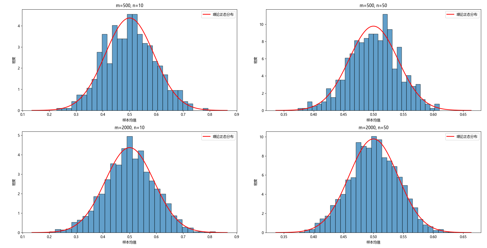

```
tensor([[3., 1., 0.],
        [2., 0., 1.],
        [4., 0., 1.],
        [3., 0., 1.]], dtype=torch.float64)
tensor([127500., 106000., 178100., 140000.], dtype=torch.float64)
```

## 输出结果解读

### X (输入特征)
```
tensor([[3., 1., 0.], 
         [2., 0., 1.], 
         [4., 0., 1.], 
         [3., 0., 1.]], dtype=torch.float64)
```

这是 **4个样本 × 3个特征** 的矩阵：

| 样本 | NumRooms | Alley_Pave | Alley_nan |
|------|----------|-------------|-----------|
| 0    | 3.0      | 1           | 0         |
| 1    | 2.0      | 0           | 1         |
| 2    | 4.0      | 0           | 1         |
| 3    | 3.0      | 0           | 1         |

- **第1列**：NumRooms（房间数），已完成缺失值填充（3.0）
- **第2列**：Alley_Pave（是否有铺过的通道）→ `1` 表示 "Pave"，`0` 表示其他
- **第3列**：Alley_nan（是否有缺失通道）→ `1` 表示缺失（NaN），`0` 表示有值

### y (目标值)
```
tensor([127500., 106000., 178100., 140000.], dtype=torch.float64)
```

这是 **4个样本的房价**（Price），单位：美元

---

## 转换为张量的意义

### 1. **深度学习的基本数据结构**
- **张量（Tensor）** 是 PyTorch 中的核心数据结构
- 本质上是一个多维数组（类似于 NumPy 的 ndarray）
- 但张量可以在 **GPU** 上运行，实现高速计算

### 2. **GPU 加速计算**
```python
# CPU 计算
X = torch.tensor(inputs.to_numpy(dtype=float))

# GPU 计算（如果可用）
X = torch.tensor(inputs.to_numpy(dtype=float)).cuda()
```

### 3. **自动微分（Autograd）**
PyTorch 张量支持**自动求导**，这是训练神经网络的关键：
```python
X.requires_grad  # 启用梯度跟踪
```

### 4. **张量 vs NumPy 数组**

| 特性 | NumPy 数组 | PyTorch 张量 |
|------|-----------|--------------|
| GPU 加速 | ❌ | ✅ |
| 自动微分 | ❌ | ✅ |
| 深度学习优化 | ❌ | ✅ |

---

## 为什么需要转换为张量？

在深度学习中，所有输入、权重、输出都是**张量**：

```python
# 神经网络的前向传播
model = nn.Linear(3, 1)  # 输入3个特征，输出1个值
prediction = model(X)     # X 必须是张量

# 计算损失
loss = criterion(prediction, y)

# 反向传播（自动计算梯度）
loss.backward()
```

**简单说**：张量是深度学习的"通用货币"，所有数据在 PyTorch 中都必须转换为张量才能进行训练和推理。

---
运行probability.py第1题

```
固定m不变，增大n：样本均值的分布更集中（方差减小），形状更接近正态分布。

固定 n 不变，增大 m：直方图变得更平滑，更精确地反映理论分布，但分布形状不变。

中心极限定理成立：无论原始分布如何（只要方差有限），当 n 足够大时，样本均值近似正态分布。
```
---
### 2. $P(A \cup B)$ 和 $P(A \cap B)$ 的上限与下限

已知 $P(A)$ 和 $P(B)$，并记 $p_A = P(A)$，$p_B = P(B)$。

**基本关系**：
$$
P(A \cup B) = p_A + p_B - P(A \cap B)
$$
$$
P(A \cap B) \in [\max(0,\, p_A + p_B - 1),\; \min(p_A, p_B)]
$$

由此可得：

- **$P(A \cup B)$ 的下限**：
  $$
  P(A \cup B) \ge \max(p_A, p_B)
  $$
  因为并集至少包含较大的那个事件。  
  更紧的下限：当 $P(A \cap B) = \min(p_A, p_B)$ 时，$P(A \cup B) = \max(p_A, p_B)$。

- **$P(A \cup B)$ 的上限**：
  $$
  P(A \cup B) \le \min(1,\, p_A + p_B)
  $$
  当 $P(A \cap B) = \max(0, p_A + p_B - 1)$ 时取到上限。若 $p_A + p_B \le 1$，则上限为 $p_A + p_B$（互斥情况）；若 $p_A + p_B > 1$，则上限为 $1$（一个包含另一个的情况）。

- **$P(A \cap B)$ 的下限**：
  $$
  P(A \cap B) \ge \max(0, p_A + p_B - 1)
  $$
  当 $A$ 与 $B$ 尽可能不重叠时达到下限（互斥时取 $0$，但若 $p_A + p_B > 1$ 则必须重叠）。

- **$P(A \cap B)$ 的上限**：
  $$
  P(A \cap B) \le \min(p_A, p_B)
  $$
  当较小事件完全包含于较大事件时达到上限。

**友元图（Venn 图）示意**：
- 上限情况：一个圆完全在另一个圆内部 → 交集最大，并集等于大圆。
- 下限情况：两圆尽量分离（但受限于总概率不超过 1）→ 交集最小，并集最大。

---

### 3. 马尔可夫链下的联合概率简化

已知 $B$ 仅依赖于 $A$，$C$ 仅依赖于 $B$，即：
$$
P(B \mid A, \text{任何其他}) = P(B \mid A), \quad P(C \mid B, \text{任何其他}) = P(C \mid B)
$$
利用概率链式法则：
$$
P(A, B, C) = P(A) \, P(B \mid A) \, P(C \mid A, B)
$$
由于 $C$ 仅依赖于 $B$，且给定 $B$ 后与 $A$ 条件独立，有 $P(C \mid A, B) = P(C \mid B)$，因此：
$$
P(A, B, C) = P(A) \, P(B \mid A) \, P(C \mid B)
$$
这正是马尔可夫链 $A \to B \to C$ 的联合概率分解。

---

### 4. 为什么不重复使用第一个更准确的测试，而是同时使用第一个和第二个测试？

假设在 **2.6.2.6** 节中：
- 测试 1：准确率更高（比如灵敏度 $99\%$，特异度 $95\%$）
- 测试 2：准确率稍低（比如灵敏度 $90\%$，特异度 $85\%$）

**若独立重复两次测试 1**：
- 两个结果可能相关（同一测试方法，误差模式可能相同），不满足条件独立假设，实际联合性能提升有限。
- 即使假设独立，两次测试均正确概率为 $0.99^2 = 0.9801$，但两次均错误的概率为 $0.01^2 = 0.0001$，整体准确性虽高，但无法处理系统性偏差（如测试 1 对某种亚型不敏感）。

**同时使用两个不同测试**：
- 两个测试基于不同的原理或生物标记物，其错误往往是独立的或负相关，组合使用（如“并联”或“串联”判据）可以大幅降低误诊率。
- 例如：两个测试同时为阳性才判阳性（串联），可极大提高特异度；任一测试为阳性即判阳性（并联），可极大提高灵敏度。
- 现实中，两个独立测试的组合往往优于重复同一测试，因为它们能互补各自的弱点。

**结论**：不同测试提供**互补信息**，而重复相同测试仅能减小随机误差，无法纠正系统误差。因此联合使用两个不同的测试通常更有效。